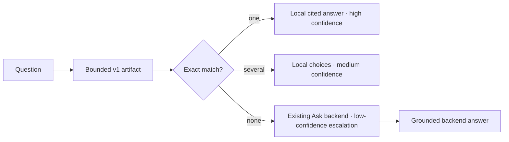

The chat on this site checks a small, verified knowledge artifact **before** it contacts the Ask backend. Exact installation, package, documentation, contribution, ecosystem, and verified-claim questions return immediately with citations. Questions that require comparison, recommendation, synthesis, or troubleshooting keep the original conversation and escalate to the backend.



## What resolves locally

- Canonical install commands such as `install agentskit`.
- Package IDs and aliases such as `@agentskit/core`.
- Exact documentation and ownership lookups such as `docs for memory` or `who owns runtime`.
- Contribution and ecosystem navigation.
- Restricted FAQs and numeric claims generated from the evidence ledger.

The matcher performs Unicode NFKC normalization, trimming, whitespace collapse, and case folding. It does **not** use prefixes, fuzzy search, embeddings, or a model. Ambiguous aliases return bounded choices; open-ended input never becomes a guessed local answer.

## Use the published contracts

```ts
import {
  createAskAdapter,
  createDeterministicAnswerAdapter,
} from '@agentskit/chat'
import {
  decodeDeterministicSiteConfig,
  verifyLocalKnowledgeArtifact,
} from '@agentskit/chat/protocol'

const site = decodeDeterministicSiteConfig(siteJson)
if (!site.ok) throw new Error(site.diagnostic.message)

const verified = await verifyLocalKnowledgeArtifact(artifactJson, {
  expectedContentHash: site.value.artifact.contentHash,
  expectedSiteId: site.value.siteId,
})

const adapter = createDeterministicAnswerAdapter({
  artifact: verified.ok ? verified.value : null,
  expectedContentHash: site.value.artifact.contentHash,
  expectedSiteId: site.value.siteId,
  fallbackMode: site.value.fallback.mode,
  fallback: createAskAdapter({ endpoint: '/api/ask' }),
})
```

Use `adapter` in the same `defineChat` definition as any other AgentsKit adapter and wire `adapter.resolveChoiceSubmission` to `choiceSubmission`. Local and backend paths then produce the same versioned `agentskit.chat.answer` envelope.

## Generation and cache contract

This site generates its artifact from `.doc-bridge/index.json`, `ecosystem.json`, and `ecosystem-claims.json` during `prebuild`:

```bash
pnpm --filter @agentskit/docs-next gen:deterministic-knowledge
```

The generator:

1. Sorts every source and entry for byte-stable output.
2. Validates all v1 bounds and safe links with `@agentskit/chat/protocol`.
3. Computes and verifies the canonical SHA-256 content hash.
4. Enforces a **96 KiB product budget**, below the protocol's 512 KiB ceiling.
5. Publishes a content-addressed JSON URL with a one-year immutable cache header.

The bundled widget verifies the site ID, trusted hash, and artifact hash before building the local index. A corrupt artifact becomes a safe backend escalation; it cannot silently answer from untrusted data.

## Performance and verification

CI measures 1,000 exact/miss resolutions and requires local p95 below **50 ms**. Unit and browser tests also prove that a known query produces a rendered citation with zero backend requests, while an unknown query invokes the existing backend exactly once with the original messages preserved.

Continue with [Build an Ask-the-docs chat](./ask-the-docs) for retrieval, streaming, guardrails, and backend implementation.
