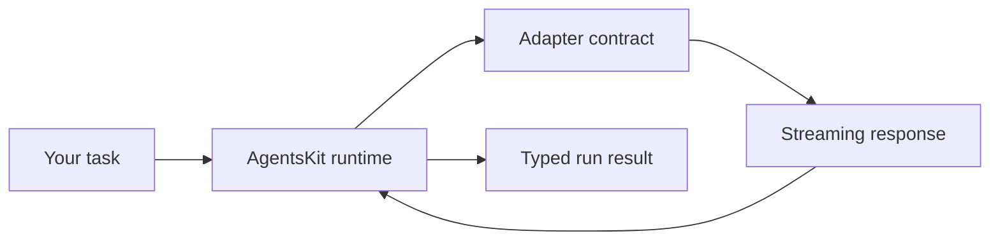

AgentsKit is the composable JavaScript and TypeScript foundation for agent runtimes, tools, memory, RAG, and interfaces. This guide starts with a real runtime that succeeds without an account, then shows the one seam you replace to use a model.

- **For:** JavaScript and TypeScript developers evaluating AgentsKit.
- **Maturity:** Beta. The core contracts are stable; the wider runtime continues to evolve.
- **First proof:** a complete local run in one file, with no hidden service.

## Run your first agent locally

Create an empty project with Node.js 20 or newer:

```bash
mkdir first-agent && cd first-agent
npm init -y
npm install @agentskit/core @agentskit/runtime tsx
```

Create `agent.ts`:

```ts title="agent.ts"
import type { AdapterFactory } from '@agentskit/core'
import { createRuntime } from '@agentskit/runtime'

const localAdapter: AdapterFactory = {
  createSource(request) {
    const task = request.messages.at(-1)?.content ?? 'your task'

    return {
      async *stream() {
        yield {
          type: 'text' as const,
          content: `Agent ready. I received: ${task}`,
        }
        yield { type: 'done' as const }
      },
      abort() {},
    }
  },
}

async function main() {
  const runtime = createRuntime({ adapter: localAdapter })
  const result = await runtime.run('Plan my first production agent')
  console.log(result.content)
}

void main()
```

Run it:

```bash
npx tsx agent.ts
```

You should see:

```text
Agent ready. I received: Plan my first production agent
```

No account, API key, or network call is required. The example uses the same `AdapterFactory` and `createRuntime` contracts as a provider-backed agent, so this first result is executable documentation rather than pseudocode.

## Understand the two moving parts



- The **runtime** owns the agent loop, messages, tools, memory, and events.
- The **adapter** turns a provider or local implementation into one streaming contract.

That boundary is why you can validate behavior locally and connect a model without rewriting orchestration.

## Connect a model provider

When the local run works, install the provider adapters:

```bash
npm install @agentskit/adapters
```

Replace `localAdapter` with the provider you want:

```ts title="agent.ts"
import { createRuntime } from '@agentskit/runtime'
import { openai } from '@agentskit/adapters'

const runtime = createRuntime({
  adapter: openai({
    apiKey: process.env.OPENAI_API_KEY!,
    model: 'gpt-4o',
  }),
})

const result = await runtime.run('Plan my first production agent')
console.log(result.content)
```

Set `OPENAI_API_KEY` and run the same command. You can use Anthropic, Gemini, Ollama, or another [supported provider](/docs/data/providers) through the same seam.

## Grow only when the task needs it

1. Add a [tool](/docs/agents/tools) when the agent must act.
2. Add [memory](/docs/data/memory) when it must retain useful context.
3. Add [RAG](/docs/data/rag/create-rag) when answers need your own sources.
4. Add [observability](/docs/production/observability) before production traffic.
5. Add [evals](/docs/production/evals) before changing prompts or models confidently.

## Continue in the ecosystem

- Need working source to adapt? Browse the [AgentsKit Registry](https://registry.agentskit.io/docs).
- Need the same agent across chat surfaces? Use [AgentsKit Chat](https://chat.agentskit.io/docs).
- Need repeatable engineering standards? Follow the [Agents Playbook](https://playbook.agentskit.io/docs).
- Need agent-readable repository handoffs? Add [Doc Bridge](https://doc-bridge.agentskit.io/).
- Need low-noise verification? Run [AgentsKit Code Review](https://github.com/AgentsKit-io/code-review-cli#readme).
- Need orchestration and governance? Continue to [AgentsKit OS](https://akos.agentskit.io/docs).

Every step is optional. AgentsKit remains the foundation; the link appears where that adjacent product solves the next concrete problem.
