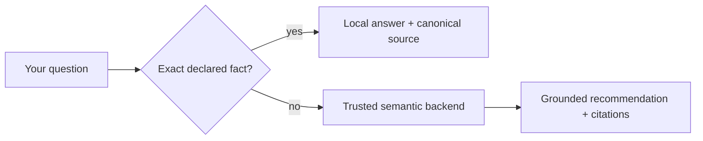

Ask Registry checks a verified local artifact before making a backend request.
Exact catalog facts feel immediate, work without model reasoning, and avoid
unnecessary tokens. Semantic recommendations still use the shared trusted
AgentsKit Chat backend and return canonical citations.

## What stays local

- exact agent IDs and unambiguous titles;
- `npx agentskit add <id>` commands;
- exact category and declared capability names;
- canonical agent pages and source links;
- contribution and AgentsKit ecosystem navigation.

Try `research`, `npx agentskit add research`, `category security`, or
`capability prompt injection defense` in Ask Registry. These queries make zero
Ask backend calls.

## What escalates

Questions that require interpretation, comparison, ranking, or problem-to-agent
recommendation are not guessed locally. For example: “Which agent should help
triage a noisy incident and draft a handoff?”

The browser sends a validated low-confidence miss with bounded conversation
context. Authentication and server configuration select the Registry corpus and
persona; query parameters cannot switch authority. The response must cite the
catalog or documentation used to ground it.

## Machine contract

- [`/deterministic/site-config.json`](/deterministic/site-config.json) pins the
  site ID, artifact path, content hash, and fallback mode.
- [`/deterministic/knowledge.json`](/deterministic/knowledge.json) is bounded,
  schema-validated, canonically serialized, and SHA-256 verified.
- [`/r/index.json`](/r/index.json) remains the installable catalog authority.

If the local artifact is unavailable or corrupt, Ask Registry fails safely to
the configured backend. It never treats an unverified local payload as fact.
