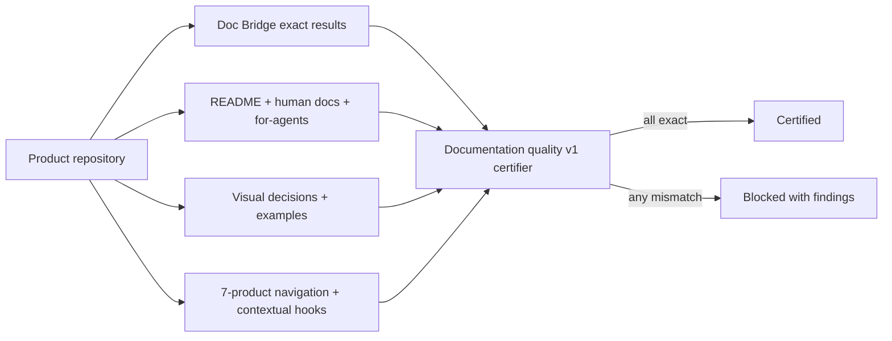

# ADR 0023 — Strict ecosystem documentation quality profile

- **Status**: Accepted
- **Date**: 2026-07-15
- **Supersedes**: —
- **Related issues**: #1198, #1204

## Context

The seven products share a canonical identity contract, but their documentation quality is
not comparable. A rounded Doc Bridge score can display `100/100` while exact handoff
coverage is lower, and the stable Documentation Standard v1 intentionally checks a compact
baseline rather than the whole ecosystem experience. Several products also expose
`llms.txt` without `llms-full.txt`, omit a `for-agents` entry point, hide siblings, or rely
on long prose where a diagram or runnable example would communicate faster.

Changing the meaning of Documentation Standard v1 in place would surprise existing Doc
Bridge consumers. The ecosystem needs a separate certification layer that composes the
stable standard with stricter, fail-closed requirements.

## Decision

AgentsKit owns `ecosystem-documentation-quality-v1.json`, a portable companion profile for
all seven products. A product is certified only when all of these conditions are true:

1. Doc Bridge reports exactly `100`, agent and human ready counts equal their non-zero
   totals, all 7 required rules pass, both recommended rules pass, and no rule is excepted.
2. `llms.txt`, `llms-full.txt`, raw source links, and a `for-agents` surface are present.
3. README, human docs, and agent docs form one narrative; the README and selected key
   journeys remain inside explicit word budgets.
4. Every selected key journey records a visual decision. Diagrams, runnable examples,
   animations, and interactives are preferred; `not-applicable` is allowed only with an
   explicit rationale and evidence.
5. Global navigation lists all seven products. The ecosystem continuation component
   exposes the other six destinations on every product except AKOS. Repository-native Code
   Review may use a Markdown equivalent.
6. Documentation, chat, and enterprise hooks point respectively to Doc Bridge, AgentsKit
   Chat, and AKOS whenever applicable. A non-applicable hook must be explicit, justified,
   and reviewable.

The profile is versioned independently from Documentation Standard v1. The executable
validator returns every failure rather than stopping at the first one. Certification is a
blocking seven-payload matrix: attestations must all be eligible, and the local verification
mode additionally recalculates paths and word counts inside every checked-out repository.
A migration status never counts as certification.

## Rationale

- A companion profile preserves the stable meaning of the public Doc Bridge standard.
- Exact numerator/denominator checks prevent rounding from masking missing coverage.
- Key-journey budgets constrain cognitive load without imposing arbitrary limits on API
  references or generated catalogs.
- Explicit visual decisions make “visual first” auditable without pretending every concept
  needs an animation.
- One global graph and contextual hooks turn independent documentation sites into a
  discovery loop.

## Consequences

### Positive

- A displayed score can no longer substitute for exact coverage.
- Machine and human documentation are certified together.
- Sparse pages, bloated journeys, missing visuals, and broken ecosystem discovery produce
  actionable failures.
- Repository-native products remain representable without inventing a Fumadocs deployment.

### Negative

- Each repository must generate and refresh a small evidence payload.
- Editorial review remains necessary to approve `not-applicable` visual and contextual-hook
  decisions.
- Local full verification requires all six repositories to be checked out together.

## Stable promotion

On 2026-07-15, all seven products passed the matrix with exact Doc Bridge coverage,
Documentation Standard v1 at 7/7 required and 2/2 recommended rules, no exceptions, the
four machine surfaces, three measured journeys, seven-product discovery, and contextual
hooks. The profile was promoted from `migration` to `stable`; publication remains a
separate, explicitly authorized step.

## Alternatives considered

| Alternative | Why rejected |
|---|---|
| Change Documentation Standard v1 in place | Breaks the meaning relied on by existing Doc Bridge consumers |
| Trust the rounded doctor score | Can certify incomplete exact coverage |
| Enforce one word limit across every page | Penalizes references and generated catalogs while missing journey quality |
| Require a visual on every page | Produces decorative noise instead of useful explanations |
| Keep cross-links as editorial convention | Drift is already present across the seven products |

## Open questions

- Whether v2 should verify live endpoints in a signed release job rather than repository CI.
- Whether Doc Bridge should later expose the companion profile as a named built-in preset.

## References

- `ecosystem-documentation-quality-v1.json`
- `ecosystem.json`
- `docs/studies/ecosystem-documentation-quality-rollout.md`
- ADR 0021
- Documentation Standard v1 in `doc-bridge.config.json`
