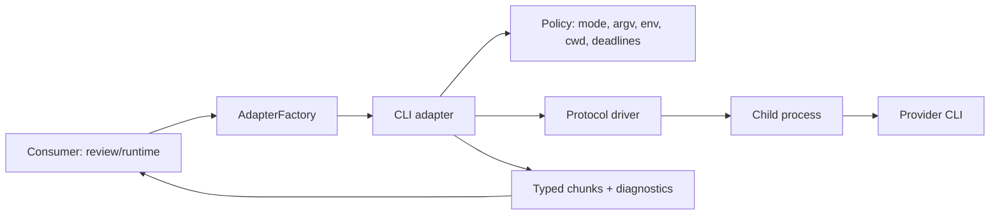

# ADR 0031 — Shared CLI adapter execution boundary

- Status: Accepted
- Date: 2026-08-30
- Supersedes: —
- Related issues: —

## Context

AgentsKit already normalizes hosted and local HTTP providers through the v1
`AdapterFactory` contract. Applications that need a coding or review agent
available only as a local CLI currently have to reimplement process spawning,
deadlines, cancellation, output parsing, credentials, diagnostics, and
fallback behavior. That duplication makes each consumer responsible for a
different security boundary and makes reviews difficult to reproduce.

The CLI boundary is also materially riskier than an HTTP adapter: it launches
an executable selected by a developer, receives untrusted prompt and model
output, and can inherit credentials and filesystem access from the host.

## Decision

Add an additive public subpath, `@agentskit/adapters/cli`, for CLI-backed LLM
adapters. It remains compatible with the existing core v1 `AdapterFactory`
and does not move process execution into `@agentskit/core`.

The subpath exposes three generic transport factories and one diagnostic
operation:

```ts
createCliAdapter(options)
createJsonCliAdapter(options)
createAcpCliAdapter(options)
diagnoseCliProvider(options)
```

Provider-specific integrations are thin manifests over these transports. The
first-party manifest set is Codex CLI, Claude Code, Grok CLI, and OpenCode.
Other providers may use the generic factories when they implement a supported
protocol; an unknown executable is never auto-discovered or auto-installed.

### Boundary and ownership



The adapter owns transport concerns only: process lifecycle, protocol framing,
typed output, cancellation, deadlines, bounded buffering, diagnostics, and
capability checks. It does not know GitHub, pull requests, merge policy,
approval policy, or review semantics. Those remain in consumers such as
`code-review`.

### Supported protocol contracts

- `exec-json`: one request over stdin and one schema-validated structured
  response over stdout. Extra stdout is a protocol error unless the manifest
  explicitly declares a framing rule. Invalid structured output fails closed.
- `exec-text`: one request over stdin and text output. Parsing text into JSON
  is never implicit; it requires an explicit consumer parser and is still
  reported as text transport at the adapter boundary.
- `acp`: an ACP-compatible framed session with negotiated capabilities,
  explicit request IDs, and a terminal response. ACP support is versioned by
  manifest and rejects unsupported versions during preflight.

MCP is not an LLM transport for this boundary. It may be used by a consumer
as a separate tool protocol, subject to that consumer's existing authorization
and egress controls; the CLI adapter does not enable MCP, plugins, or arbitrary
terminal commands in safe mode.

### Safety modes and authentication

`review-safe` is the default and is intended for unattended review:

- executable and arguments are declared by the manifest; no shell is used;
- provider selection is explicit; no auto-install, PATH crawling, or command
  discovery is performed;
- environment variables are an allowlist, with secrets passed only through
  the declared credential mechanism;
- working directory, source access, and output limits are explicit;
- MCP, plugins, arbitrary terminal tools, and interactive login are denied;
- native CLI login is not silently reused.

`trusted-local` is an explicit opt-in for an interactive developer machine.
It may use a provider's native login and local configuration, but it is not an
isolation boundary and must be visible in diagnostics and audit metadata.

`restricted-environment` is available when a provider accepts explicit
credentials and a minimal environment. It is an environment allowlist, not a
sandbox: the adapter cannot claim filesystem, process, network, or kernel
isolation it does not provide.

Authentication is therefore explicit per mode: AgentsKit credentials for API
adapters, a declared credential for `restricted-environment`, and native
provider login only for `trusted-local`. Secrets are redacted from diagnostics,
errors, and persisted metadata.

### Capabilities and options

The adapter reports protocol, structured-output, streaming, tool, auth-mode,
and cancellation capabilities before execution. Common options are stable;
provider-specific options live under namespaced extensions and cannot silently
change the common safety policy. Unsupported requested capabilities fail during
preflight, before a child process is started.

Structured output is fail-closed. A malformed response, premature EOF, missing
terminal marker, or protocol violation is an error and cannot be interpreted
as an approval or successful review. Text parsing is opt-in and owned by the
consumer.

### Deadlines, cancellation, retry, and fallback

Each operation has a deadline, an abort signal, and a bounded output budget.
Cancellation is propagated to the child process; escalation from graceful
termination to forceful termination is bounded and leaves an orphan-process
check in diagnostics. A timed-out or aborted operation is incomplete.

Retries are limited to idempotent pre-response failures and use bounded
backoff. A fallback chain may advance only before the first semantic response.
The chain, selected provider, and reason are recorded. Once a semantic response
has started, the operation fails rather than silently switching providers.

### Data, checkpoints, and observability

The adapter emits typed diagnostics containing run ID, provider ID, protocol,
mode, timing, exit classification, and redacted capability/auth metadata.
Metadata-only checkpoints are the default. Prompt text, source content, raw
provider output, credentials, and environment values are not persisted unless
the consumer explicitly opts in with a retention policy. Resume is a consumer
concern and must not turn partial output into a complete result.

## Rationale

- A shared boundary prevents every consumer from inventing a different process
  and security implementation.
- Generic transports keep provider manifests small and make common protocols
  reusable across the ecosystem.
- An additive subpath preserves core v1 compatibility and avoids forcing CLI
  concerns into the stable core contract.
- Explicit modes and fail-closed parsing make unattended review safer without
  preventing trusted local development.

## Consequences

Positive:

- `code-review` and future consumers share deadlines, cancellation, diagnostics,
  capability negotiation, and credential rules.
- Providers can be added as data/configuration when they use a supported
  protocol instead of adding another process runner.
- Review outcomes remain auditable: a fallback or incomplete response cannot be
  mistaken for an approval.

Negative:

- The adapter must support platform-specific process behavior on macOS, Linux,
  and Windows.
- Manifests and protocol fixtures become compatibility contracts that require
  maintenance.
- Native CLI authentication remains intentionally less portable than API-key
  authentication.

## Alternatives considered

1. **Implement a runner in every consumer.** Rejected: duplicates the highest
   risk code and produces inconsistent semantics.
2. **Add each provider as a bespoke adapter.** Rejected: increases maintenance
   and does not solve shared lifecycle/security behavior.
3. **Put child-process execution in core.** Rejected: expands the stable core
   contract and its platform/security surface without benefit to HTTP users.
4. **Treat MCP as the LLM transport.** Rejected: MCP is a tool protocol, not a
   provider execution contract.
5. **Parse arbitrary prose as structured success.** Rejected: it can convert
   malformed or incomplete output into a false approval.

## Threat model and required mitigations

| Threat | Required mitigation | Failure behavior |
|---|---|---|
| Shell/argument injection | `argv` execution without a shell; manifest-owned executable and arguments | Reject before spawn |
| Prompt injection or hostile model output | Treat prompt/output as untrusted; schema validation and fail-closed terminal state | Typed provider error |
| Credential leakage | Explicit credential modes; environment allowlist; redacted errors/diagnostics | Abort and redact |
| Accidental tools, MCP, or plugins | Deny in `review-safe`; capability preflight | Reject before spawn |
| Runaway process or orphan | Per-phase deadline, abort propagation, bounded termination escalation, orphan diagnostic | Incomplete operation |
| Output/memory exhaustion | Bounded stdout/stderr and frame sizes | Typed resource error |
| Wrong executable or version drift | Explicit manifest, version/protocol check, no auto-install/discovery | Preflight failure |
| Partial or mixed-provider result | One terminal outcome; fallback only before semantic response | Incomplete/error |
| Sensitive persistence | Metadata-only checkpoints by default; explicit retention for raw data | Omit raw data |

The detailed library threat model must retain this boundary as an active
surface; implementation work cannot mark a row shipped until the corresponding
runtime and integration evidence exists.

## Compatibility and rollout

The first implementation is a minor release of `@agentskit/adapters` after the
current `0.15.x` line, with `./cli` as an additive export. Existing imports and
core v1 behavior remain unchanged. Any temporary consumer aliases are kept for
one migration cycle and emit deprecation diagnostics before removal.

Rollout order:

1. Freeze this ADR and the public protocol/capability fixtures.
2. Implement the generic CLI transports and internal safe process runner.
3. Add manifests and preflight diagnostics for the first-party CLIs.
4. Migrate `code-review` without moving GitHub or merge policy into adapters.
5. Validate on Node 20+ across macOS, Linux, and Windows, including protocol
   fixtures, actual optional CLI smokes, abort/timeout/retry/orphan/security
   tests, three real reviews, and resume behavior.
6. Adopt the subpath in the remaining ecosystem consumers.

No provider is eligible for unattended approval until all required checks pass;
CI availability is not itself a substitute for protocol, safety, or review
evidence.

## Open questions

- Which ACP versions and capability extensions should be supported in the first
  implementation line?
- Which process-group primitives can be made equivalent across the supported
  operating systems?
- Which optional CLI smoke tests are available in release environments without
  requiring interactive credentials?

## References

- [ADR 0001 — Adapter contract](./0001-adapter-contract.md)
- [ADR 0012 — Vendor adapter scope](./0012-vendor-adapter-scope.md)
- [ADR 0026 — Integration execution safety boundaries](./0026-integration-execution-boundaries.md)
- [Adapters package handoff](/docs/for-agents/adapters)
- [AgentsKit threat model](../../security/threat-model.md)
