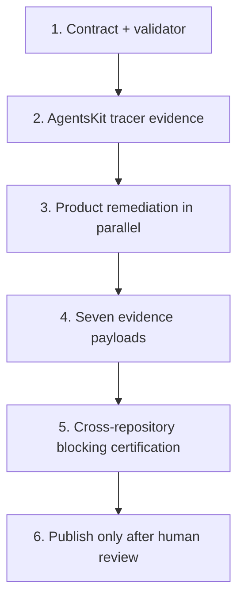

# Ecosystem documentation quality v1 rollout

**Status:** certified locally · publication pending · **Owner:** AgentsKit coordination ·
**Date:** 2026-07-15

## Objective

Certify the seven-product documentation system as concise, complete, visual-first,
machine-readable, and mutually discoverable. Certification is exact: migration and rounded
scores never count as green.

## Certification result

| Product | Doc Bridge | Standard v1 | Continuation |
|---|---:|---:|---:|
| AgentsKit | 25/25 | 7 + 2 | 6 peers |
| Registry | shared monorepo gate | 7 + 2 | 6 peers |
| AgentsKit Chat | 28/28 | 7 + 2 | 6 peers |
| Agents Playbook | 131/131 | 7 + 2 | 6 peers |
| Doc Bridge | 10/10 | 7 + 2 | 6 peers |
| Code Review | 1/1 | 7 + 2 | 6 Markdown peers |
| AKOS | 163/163 | 7 + 2 | excluded by contract |

All payloads are in `docs/evidence/ecosystem-documentation-quality/`. The default gate
validates portable eligibility but cannot certify without repository roots. `--verify-local`
remeasures every path, prose count, content digest, and live Doc Bridge result against the
corresponding checkout; only that mode can certify a working-tree attestation.

## Publication order

Publication is intentionally pending. The current public Chat home and `llms.txt` resolve,
while `/docs` still returns 404 until this branch is deployed. Publish Chat first, verify
`/docs`, `/llms.txt`, `/llms-full.txt`, `/raw`, and `/for-agents`, and only then publish the
canonical cross-links in the other six products. This prevents a coordinated release from
shipping links to a route that is not live yet.

## Architecture and rollout

### Codex-owned work

- Own the profile, validator, tests, canonical seven-product graph, and release gate.
- Review every Grok draft against source and product truth before it enters a branch.
- Implement technical blockers: Chat `/docs`, AKOS Doc Bridge onboarding, Registry route,
  machine surfaces, generated ecosystem component, and deterministic evidence.
- Run Doc Bridge exact coverage, conformance, tests, builds, and live endpoint checks.

### Grok-owned work

- Inventory Registry placeholder copy and prepare content batches.
- Map Playbook pages to Mermaid, runnable example, animation, or interactive treatment.
- Consolidate Doc Bridge editorial duplication and curate its indexed corpus.
- Draft Code Review lens explanations and advisory-to-blocking flow.
- Reconcile AKOS naming and quickstart claims against source.

Grok does not publish, merge, change canonical contracts, or certify its own output.

## QA plan

### Unit tests

- Reject a rounded `100` when exact agent or human coverage is incomplete.
- Reject any required or recommended Doc Bridge rule that does not pass exactly.
- Reject missing `llms.txt`, `llms-full.txt`, raw-source, or `for-agents` evidence.
- Reject README and key-journey word counts outside their configured budgets.
- Reject silent visual and contextual-hook exceptions.
- Reject a global product list other than the canonical seven or a sibling set other than
  the other six products.

### Integration tests

- Parse the committed profile and canonical ecosystem manifest together.
- Generate the shared ecosystem bar from seven ordered products.
- Keep application snapshots byte-identical to the canonical manifest.
- Produce a deterministic findings report from a fixed evidence fixture.

### Regression scope

- `ecosystem.json` v2 compatibility projection.
- Ecosystem claims generation.
- Hosted ecosystem bar current-product detection.
- Documentation Standard v1 and existing Doc Bridge doctor output.

### Definition of Done for each product slice

- Acceptance criteria, dependencies, test plan, documentation impact, and upstream-adoption
  record are present in the issue or change packet.
- Exact Doc Bridge score and counts pass; 7/7 required and 2/2 recommended pass.
- README, docs, `for-agents`, `llms.txt`, `llms-full.txt`, and raw sources agree.
- Three representative journeys meet the word budget and record a useful visual decision.
- Global navigation lists seven products and the local continuation surface lists six peers,
  except that AKOS does not render the continuation component.
- Contextual hooks are linked or explicitly justified as not applicable.
- Tests, build, link checks, and live endpoint verification pass.
- Codex reviews and certifies the result before merge or publication.

## Tracer slice change packet

### Acceptance criteria

- The committed profile names the canonical seven products and preserves the AKOS component
  exclusion.
- A product with doctor `100` but coverage `346/350` is rejected.
- The validator recomputes local prose counts, checks evidence paths, and rejects missing
  machine surfaces or silent applicability exceptions.
- The canonical manifest generates seven global-bar items and six peers per product.

### Dependencies

- ADR 0021 and `scripts/lib/ecosystem-contract.mjs`.
- Doc Bridge Documentation Standard v1 and its exact conformance payload.
- Existing ecosystem manifest sync and drift checks.

### Documentation impact

- Adds ADR 0023, the portable v1 profile, this rollout, and updated canonical Doc Bridge
  links. It marks the old five-property study as historical.

### Upstream-adoption record

- **Inspected source:** `ecosystem.json`, `scripts/lib/ecosystem-contract.mjs`,
  `scripts/lib/ecosystem-readiness.mjs`, `scripts/sync-ecosystem.mjs`, and Doc Bridge's
  Documentation Standard v1 output.
- **Reused contracts:** ecosystem v2 product identity, deterministic sync, and Doc Bridge
  exact rule results. No AgentsKit runtime primitive is reimplemented.
- **Local application behavior:** the companion validator composes those contracts into an
  editorial certification result; it does not change agent runtime or package behavior.
- **Linked upstream work:** none required for the tracer slice; later sibling migrations
  consume the committed portable JSON profile.

## Registry route tracer change packet

### Acceptance criteria

- `/agents` renders the searchable catalog as a first-class canonical route and preserves
  filter, sort, pagination, and comparison state on that route.
- the Registry publishes an application icon and includes `/agents` in its sitemap.
- documentation links target `/agents`, and the route presents all six sibling products as
  contextual next steps without implying that any product is required.

### Dependencies and test plan

- Reuses the existing `Browse`, Registry index, Fumadocs home layout, and canonical ecosystem
  roles; no agent runtime or catalog primitive is recreated.
- Unit-test canonical catalog URL generation, then run Registry type-check, tests, build,
  ecosystem contract tests, and live endpoint checks after deployment.

### Documentation impact and Definition of Done

- Quick start and usage docs point at the canonical catalog URL. The route, favicon, sitemap,
  six peer links, and responsive catalog must pass locally before publication.

### Upstream-adoption record

- **Inspected source:** Registry home catalog, category/detail routes, sitemap, layout metadata,
  and existing catalog unit tests.
- **Reused exports:** `getRegistryIndex`, `Browse`, `HomeLayout`, and `baseOptions`.
- **Local behavior:** route ownership, navigation, metadata, and presentation only.
- **Linked upstream work:** none; no missing AgentsKit primitive was found.
